[TOC]
# 实验四python-mxnet版本参考
- 深度学习参考资料推荐
	- mxnet:http://zh.gluon.ai/
	- pytorch:https://tangshusen.me/Dive-into-DL-PyTorch/#/
- 本实验可以参考上面两个资料的10.7和10.8章节，tensorflow也有相关示例代码如有兴趣可以自行查找
- 如果有python开发环境可以跳过2.1-2.3节
- 有深度学习相关兴趣的可以尝试自行实现``class BiRNN``和``class TextCNN``，以及main函数中用到的所有``d2l``相关方法

## 1. 下载相关数据

### 1.1 下载训练数据
打开主函数中的步骤1的代码注释可以自动从官方下载，若采用代码下载可以忽略下面几步，代码将会自动完成。备注：大约消耗几百兆流量（另外为了想要提高训练速度，可以删除训练集和数据集中的部分数据，其中一个txt代表一条数据，test为测试集文件夹，train为验证集文件夹，删除两个文件夹下的negitave和active文件夹里的部分数据即可，尽量保持每个文件夹下的数据条数相等）
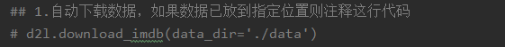

1. 下载``aclImdb_v1.tar.gz``压缩包
2.  在工程文件夹下新建文件夹data
3. 解压并将压缩包里面的acllmdb文件夹放到data目录

### 1.2 下载mxnet词向量预训练集
主函数中4.1步代码会去检测与训练集是否存在，如果不存在会自动下载，``网络条件良好情况下推荐利用代码下载``。若利用代码下载忽略下面几步
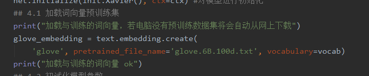

- 下载glove.6B.zip
- 解压到指定目录
	- 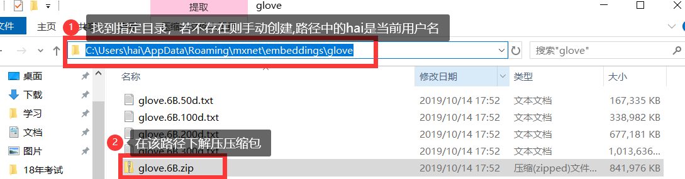

### 1.3 确认工程文件结构
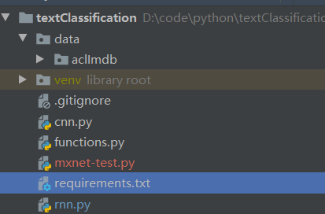

## 2.开发环境搭建

### 2.1 python 安装
python开发环境搭建参考：https://www.runoob.com/python/python-install.html
### 2.2 加载工程-以pycharm为例
1. 打开pycharm软件
2. 左上角File-->open
	- 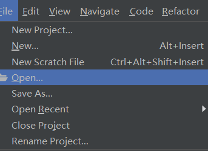
3. 找到工程文件夹，选中，点击确定
	- 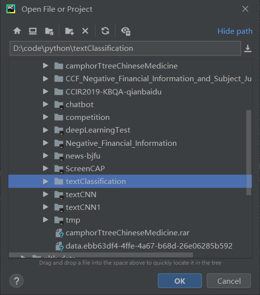
### 2.3 创建虚拟环境
（可以省略此步骤，但是推荐使用虚拟环境可以避免很多环境相关的问题）
1. 点击右上角``Add Configuration``按钮
2. 点击File-->Setings-->Project:textClassifcation-->弹框右上角设置按钮-->点击Add按钮
	- 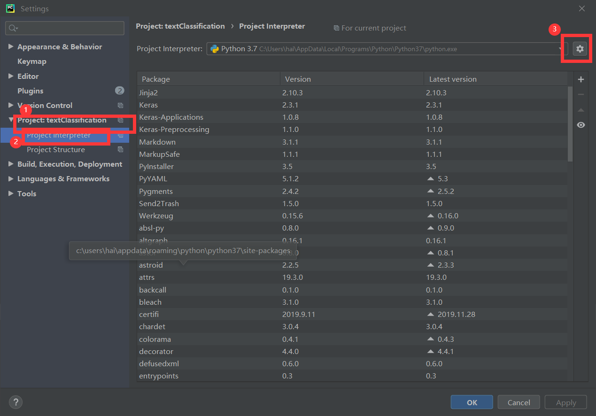
3. 直接点击弹窗确定按钮（如果使用Conda的可以自行选择conda虚拟环境），注意下图红框部分如果没有python编译器请重新按照本教程1.1节配置python
	- 
4. 点击Setings对话框的确定按钮

### 2.4 mxnetGPU版本配置
这里需要有了解显卡相关知识，有一定难度，但是GPU版本运算速度很快可以节省实验时间。若不了解知识或者电脑没有独立显卡跳过此步骤。
- 安装cuda
- 安装cuda对应版本的mxnet：如安装的cada10.0，那么将requirements文件中添加一行``mxnet-cu100``其中100对应cuda版本号10.0

### 2.5 下载需要的库
下载库需要联网，耗费一定流量
点击下方terminal，执行``pip install -r requirements.txt``
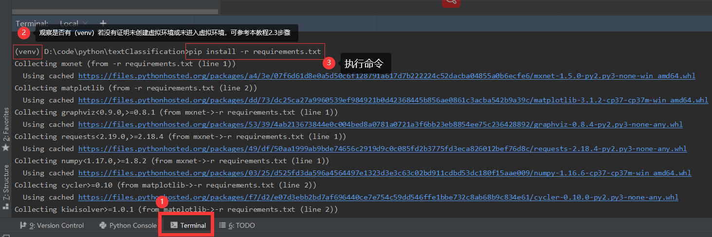

### 2.6 测试开发环境
- 运行（其他文件运行方式相同）
	- 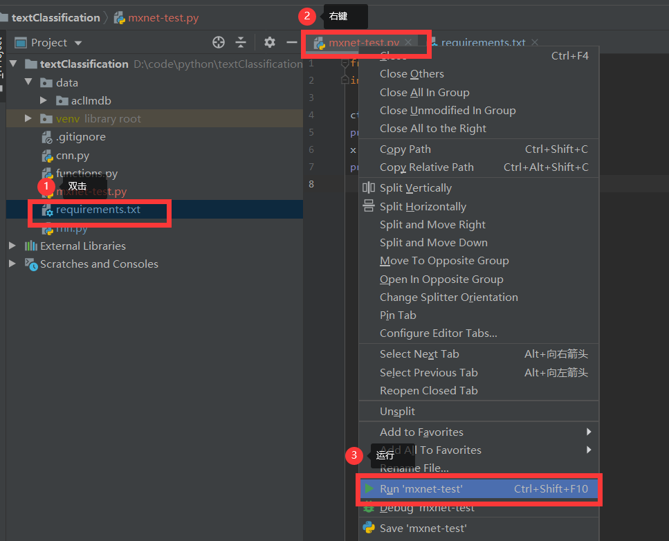
- 结果（若出现问题具体问题具体分析，若短时间没有解决建议放弃，借用其他同学电脑完成实验，目前知道的可能mxnet与vs有相互依赖会导致某种错误）
	- 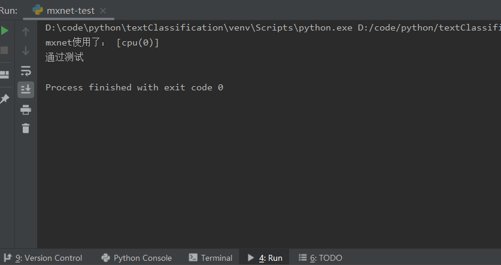
	- 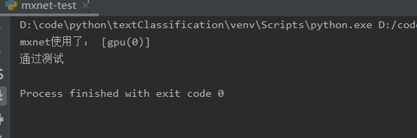

## 3. 实验分析角度
- RNN与CNN可以二选一
	- CPU版本推荐使用RNN模型，速度会快一些
	- GPU版本推荐使用CNN模型，速度会快一些
- 输出
	- 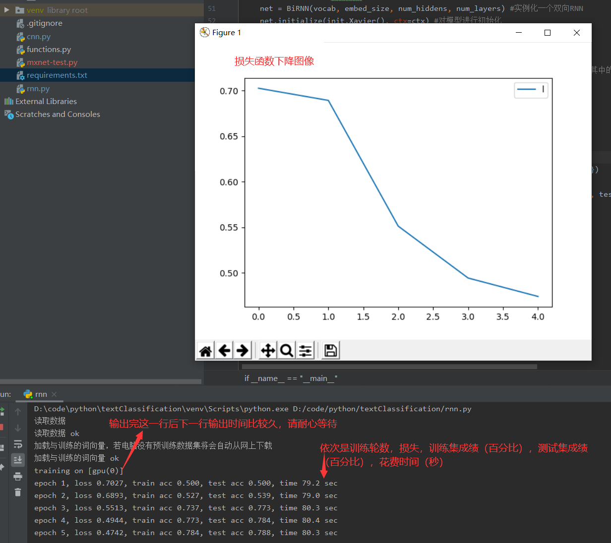

###RNN,CNN通用参数
- ``batch_size``模型一次计算几条数据，影响训练速度（时间）但是不影响结果，这里可根据内存/显存适当调整，建议是2的n次方，如64，32
- ``lr`` 学习率，影响的损失下降的速度可以认为是梯度下降的速度，也就是沿着导数方向一次走多远，参照课堂上的抛物线找最小值过程。这里可以建议设置0.1，0.01，0.001观察结果
- ``num_epochs``训练轮数，一般最好的设定轮数就是loss值不再下降趋于平缓停止训练
- ``embed_size``，与加载的词向量的维度有关这里用的是100维度向量，所以设置为100
	- 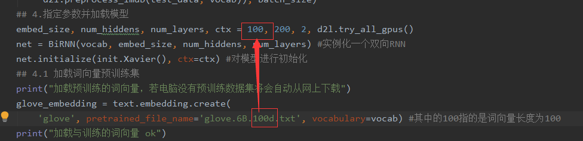

### RNN特定参数
- ``num_hiddens``隐藏层的输出维度，回忆课堂RNN模型隐藏层输出，这里可以尝试设置50，100，150等对比loss下降速度和time发生了什么变化
- ``num_layers``,RNN的层数，这里用的两层，推荐不调使用默认，也可以改成4观察对结果的影响
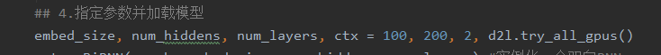

### CNN特定参数
- ``kernel_sizes``卷积核设定，代码中默认用来3个核，大小是3，4，5可以尝试改变核的个数，大小观察结果变化，分析结果
- ``nums_channels``,每个核对应的输出向量的维度，这里默认3个核都个了100可以适当调整大小
	-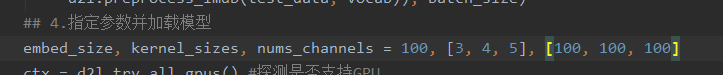